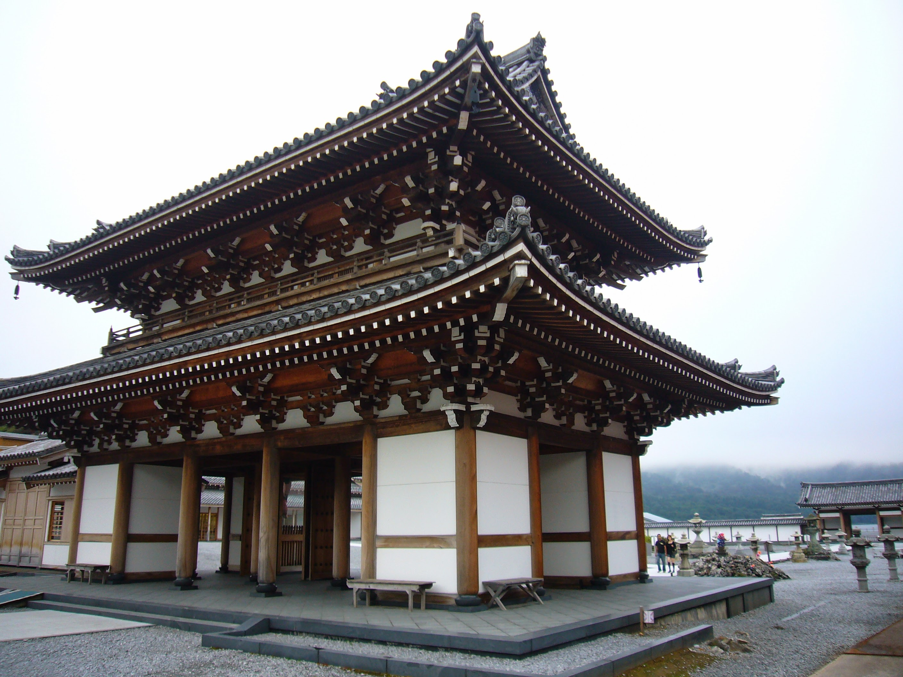
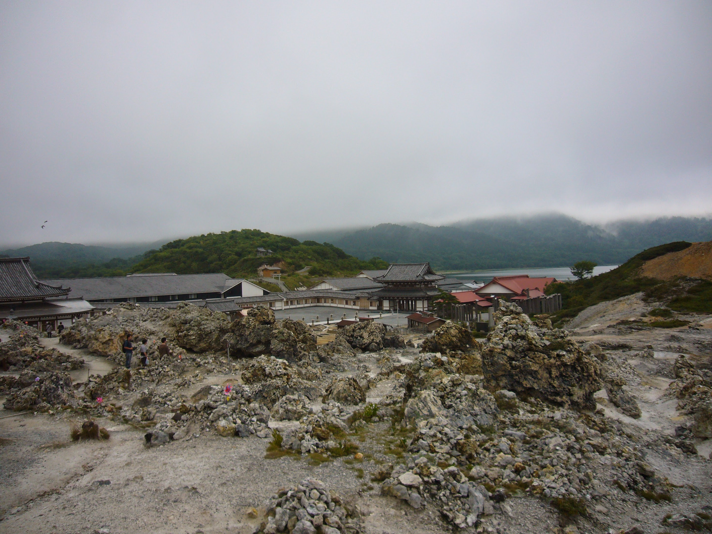
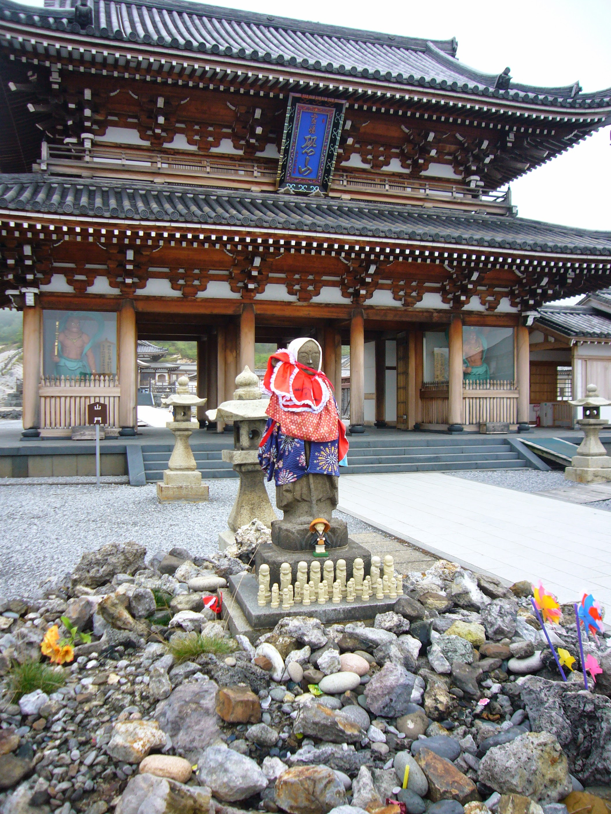
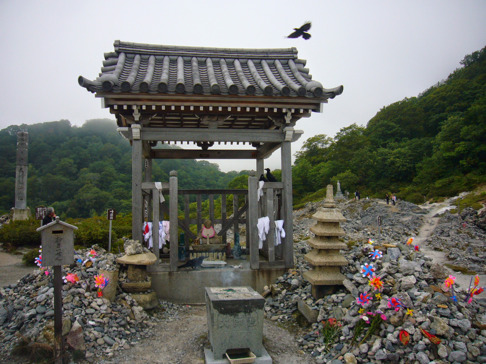
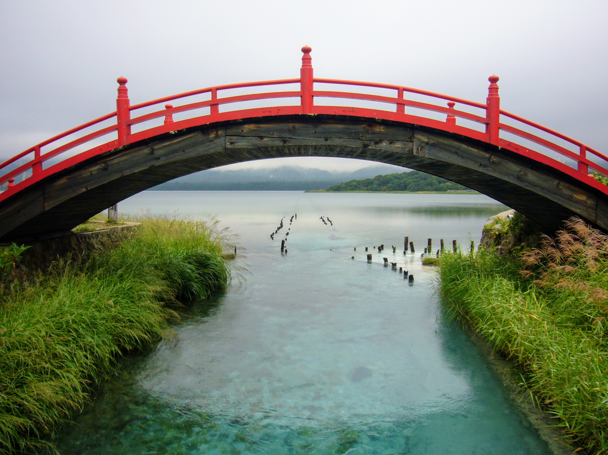

When I had the honor and privilege of living in Japan while serving in the U.S. Air Force, I sometimes adventured on the weekends.

I was drawn to this amazing holy site in an actively volcanic park, Osorezan. It's definitely not meant for tourists, yet I conducted myself with as much quietness and respect as possible and no one seemed offended by my curiosity. 

Osorezan (Doom Mountain) is mythically an entrance to the underworld, yet this being Japan it's also a functional -but very somber and drab- outdoor religious complex, festooned with colorful gifts and offerings left by visiting families. The theme here is memorials to lost children.

It does have the same little fortunes and souvenirs that every shrine in Japan offers, but it seems to mostly exist for Buddhist ceremonies surrounding childrens' ghosts. There's also a very pragmatic and unfancy bathhouse that takes advantage of the doubtless amazing mineral waters.

## Osorezan, Mount Doom

  Not the bathhouse. An ornate gateway near the entrance.

## Natural piles of rock and sulphur slag seep smelly gas

  Coins get piled around the vents and slowly corrode and melt from the earth's heat and poison.

## Osorezan, Mount Doom

  I saw many jizo statues wearing custom outfits, perhaps evoking the memory of kid's clothes. Many of the jizo here are the size of children, larger than usual. Collections of many tiny jizo are also everywhere.

## Pinwheels spin prayers in the thick, volcanic air

  Crows eat offerings of candy and snack food, but only after the family leaves. This is Japan: the baseline politeness is absurd. 

## An acid lake surrounds Osorezan

  The water is dangerous just like a poison zone in a JRPG!

If you ever have the chance to visit Mt. Doom at the top of Japan, do not hesitate. These pictures were taken in late August 2008, and there were no fees to park nor enter at the time (donations were welcome). I feel incredibly lucky to have discovered and experienced this sincere, hidden place.